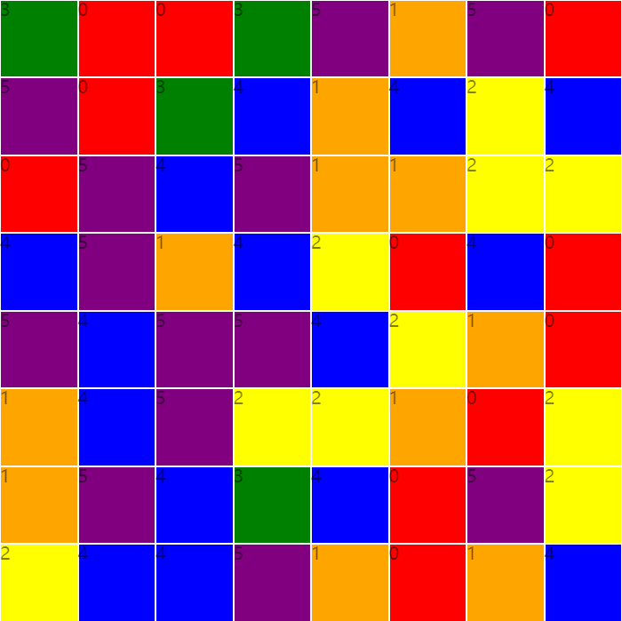

#三消游戏的简单实现

调用方法
---

    Game.initGame()

html结构
---

    

        

            <ul id="map" class="map">
            </ul>
            <ul id="blocks" class="blocks">
            </ul>
        

        

            

        

    

游戏设置
---

    var Game = {
        hard: 6, //游戏难度:初始为六个方块,随时间增加难度
        TimeLimt: 60 * 1000, //游戏时间限制, 默认为1分钟
        liveTime: this.TimeLimt, //还剩多少时间
        MapSize: 8, //地图大小:行列大小, 为正方形
        score: 0, //得分成绩
        //component
        component: {
            mapEle: null,
            mapCellList: null,
            blocksEle: null,
            gameBoxEle: null,
            gameEle: null,
            timeLimtBar: null,
            scoreEle: null,
        }
    };